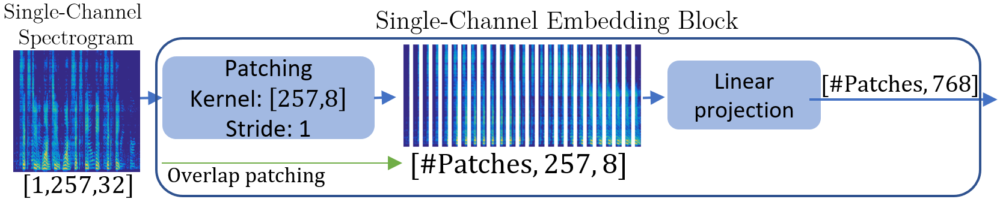
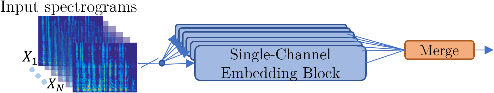

# CSD-Audio-Only
### Concurrent Speaker Detection: A Multi-Microphone Transformer-Based Approach

This repository contains the code for the **audio-only model** presented in the paper:  
📄 **"Concurrent Speaker Detection: A Multi-Microphone Transformer-Based Approach"**  
🔗 [Link to Paper](https://ieeexplore.ieee.org/document/10715386) (Published in EUSIPCO 2024)  

## 📂 Repository Structure

```bash
CSD-Audio-Only/
├── doc/
│   └── Figures/
│   └── Presentation_EUSIPCO_2024.pdf
├── src/
│   ├── CSD_model.py
│   └── Inference.py
├── README.md
└── ...
```
* **`doc/Figures/`**: Contains the figures used in this repository
* **`doc/Presentation_EUSIPCO_2024.pdf`**: Presentation slides for the paper, presented as a special session at EUSIPCO 2024.
* **`CSD_model.py`**: PyTorch implementation of our proposed CSD model.<br/>
* **`Inference.py`**: This file provides a demonstration of how to use the CSD model for inference. <br/>
It includes code for generating a random input of the same shape as the model's expected input and then using the model to generate predictions.
Additionally, it prints the model's summary.


## 📄 Presentation
The presentation slides for this paper are available in the doc/ folder:
presentation.pdf: Provides an overview of the research, methodology, and results presented in the paper and published at the EUSIPCO 2024 conference.


## 📌 Overview
This model classifies audio segments into three categories:

1️⃣ **Noise only**  
2️⃣ **Single-speaker activity**  
3️⃣ **Concurrent-speaker activity**  

The method was evaluated on **AMI, AliMeeting, and CHiME-5** datasets, demonstrating state-of-the-art results.  

Our primary focus is on Concurrent Speaker Detection (CSD), which classifies audio segments into the three classes above.
For comparison with existing methods, we also evaluate our model on the related binary classification tasks:<br/>
1️⃣ **Voice Activity Detection (VAD)**: Distinguishes between speech (single/multiple speakers) and non-speech.  
2️⃣ **Overlapped Speech Detection (OSD)** : Identifies segments with overlapped versus non-overlapped speech.  


## Model Architecture - High Level
The high-level architecture of our proposed model is presented in the following figure.<br/>
It consists of three main blocks: Embedding, Transformer, and Classification.<br/>
1️⃣ The Embedding block linearly projects the input data and generates the input tokens for the Transformer model.<br/>
2️⃣ The Transformer block captures complex relations within its input data.<br/>
3️⃣ The Classification block maps the learned features to the final output predictions.<br/>
<p align="center">
  
</p>

## Model Architecture - Single-Channel Embedding Block
The single-channel embedding block transforms the input data into tokens used by the Transformer block. <br/>
The input log spectrum is split into patches with a 2-D learnable kernel with a stride set to 1. <br/>
Our analysis shows a useful patch size of 257 x 8, as it jointly analyzes the entire frequency axis.
Each patch is then linearly projected to a dimension of 768, resulting in a tensor of shape #Patches x 768.
<p align="center">
  
</p>


## Model Architecture - Multi-Channel Embedding Block
For multi-channel processing, we apply single-channel embedding to each microphone signal and then combine them through concatenation (Type #1), which showed the best performance in our experiments.<br/>
We evaluated three merging strategies: <br/>
1️⃣ Type #1 - concatenation<br/>
2️⃣ Type #2 - summation<br/>
3️⃣ Type #3 - averaging with shared weights (Siamese networks)<br/>
The figure illustrates how these merging operations can be implemented with either shared or distinct weights across channels.
<p align="center">
  
</p>


## 📄 Citation  
If you use this work, please cite:

  ```bibtex
@INPROCEEDINGS{10715386,
  author={Eliav, Amit and Gannot, Sharon},
  booktitle={2024 32nd European Signal Processing Conference (EUSIPCO)}, 
  title={Concurrent Speaker Detection: A Multi-Microphone Transformer-Based Approach}, 
  year={2024},
  pages={897-901},
  keywords={Training;Databases;Noise;Europe;Transformers;Data models;Calibration},
  doi={10.23919/EUSIPCO63174.2024.10715386}}
```
