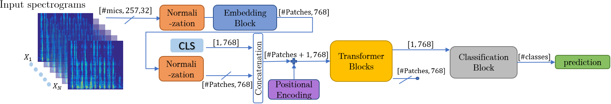

# CSD-Audio-Only
### Concurrent Speaker Detection: A Multi-Microphone Transformer-Based Approach

This repository contains the code for the **audio-only model** presented in the paper:  
📄 **"Concurrent Speaker Detection: A Multi-Microphone Transformer-Based Approach"**  
🔗 [Link to Paper](https://ieeexplore.ieee.org/document/10715386)  

## 📌 Overview
This model classifies audio segments into three categories:

1️⃣ **Noise only**  
2️⃣ **Single-speaker activity**  
3️⃣ **Concurrent-speaker activity**  

The method was evaluated on **AMI, AliMeeting, and CHiME-5** datasets, demonstrating state-of-the-art results.  


## Model Architecture - High Level
The high-level architecture of our proposed model is presented in Fig. 1. It consists of three main blocks: Embedding, Transformer, and Classification.
The Embedding block linearly projects the input data and generates the input tokens for the Transformer model.
The Transformer block captures complex relations within its input data.
The Classification block maps the learned features to the final output predictions.


## Model Architecture - High Level


## Model Architecture - High Level


## 📄 Citation  
If you use this work, please cite:

  ```bibtex
@INPROCEEDINGS{10715386,
  author={Eliav, Amit and Gannot, Sharon},
  booktitle={2024 32nd European Signal Processing Conference (EUSIPCO)}, 
  title={Concurrent Speaker Detection: A Multi-Microphone Transformer-Based Approach}, 
  year={2024},
  pages={897-901},
  keywords={Training;Databases;Noise;Europe;Transformers;Data models;Calibration},
  doi={10.23919/EUSIPCO63174.2024.10715386}}
